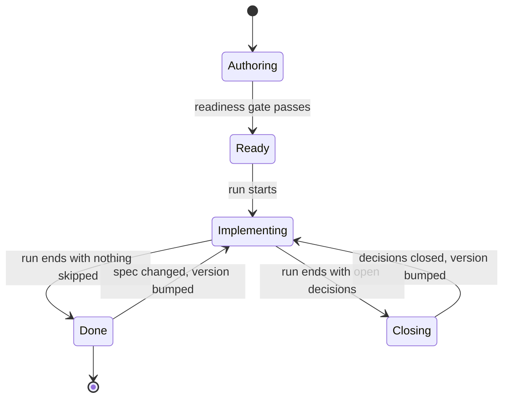

The lifecycle of an AASDD spec: how a spec is authored from a product vision, when it is complete enough to implement, how an implementation run proceeds without human review, and how what the run leaves open is closed.

## Overview

A spec is an oracle: an artifact from which an implementation and its tests can be derived without asking the author a question. Getting a spec to that state is design work. It is done one level of the tree at a time, and reviewed at each level against scenarios and open decisions rather than against running code. Once the spec is there, implementation is a single autonomous run.

The lifecycle applies per spec. Some teams author one spec for an entire product before implementing any of it; others author many small specs, delegating between them (see [Delegation](METHODOLOGY.md#delegation)), and implement each as it becomes ready. The gate and the run are the same in both cases; only the granularity differs.

## Lifecycle

| State          | Activity                                                                                                        |
| -------------- | --------------------------------------------------------------------------------------------------------------- |
| `Authoring`    | The spec is below `1.0.0`. Abilities are decomposed level by level; sections may be pending and decisions open. |
| `Ready`        | The spec is at `1.0.0` or above and every readiness condition holds.                                            |
| `Implementing` | An agent derives tests and implementation from the spec, ability by ability, with no human review.              |
| `Closing`      | The author closes the decisions the run recorded, and the affected contracts are updated.                       |
| `Done`         | Every ability is implemented and every spec-derived test passes.                                                |

A spec at `1.0.0` or above never returns to `Authoring`. A change to a ready spec is made complete — no pending sections, no open decisions, coverage intact — before its version is bumped.

## Authoring

Authoring proceeds from the root of the tree outward, one level at a time. At every step the spec stays conformant: what is not yet written is marked `_Pending._`, and what is not yet decided is recorded as an open decision.

### Vision first

Write `spec.md` before any ability: the summary sentence, Purpose, Non-Goals, and Success Criteria. Each success criterion is an outcome someone outside the system can observe (Authoring Rule 11). The Abilities and Scenarios columns start as `—`.

### Root abilities

Derive the root abilities from the success criteria: one for each distinct thing the system does for someone outside it. Name each criterion's abilities in its Abilities column (Authoring Rule 12). Each root ability starts as a stub — heading, purpose sentence, and `_Pending._` in every required section.

### One level at a time

For each ability that needs decomposition (Authoring Rule 2):

1. **Sketch.** Create each sub-ability as a stub and write the parent's Composition section, or the spec's state machine when the sub-abilities execute in a coordinated lifecycle. This fixes what the children are and what flows between them before any child is specified.
2. **Trace.** Write the scenarios this level must satisfy, including a divergence for every failure the parent reports to its caller. Fill the Scenarios column of every success criterion they exercise.
3. **Review.** The reviewer reads the scenarios and the Composition, not the type tables. They accept or change the shape of the level, and close the open decisions surfaced so far.
4. **Specify.** Write each sub-ability's contract: inputs, outputs, invariants, failure modes. Define concept types as they emerge. Every choice the contract leaves open that an implementer would otherwise make silently becomes an open decision with its options listed.
5. **Recurse** into each sub-ability that needs decomposition. Stop where Authoring Rule 3 applies.

### Rules for authoring agents

- Never resolve an open choice silently. If the vision, the parent's contract, and the scenarios do not determine the answer, record an open decision and continue.
- Never write an invariant that references a value the spec does not define. Thresholds, limits, deadlines, and policies are inputs or concept types, or they are decisions.
- Work one artifact at a time, and verify the spec after each change.

## The readiness gate

A spec is ready when every condition below holds. Passing the gate is what a `1.0.0` version means. Conditions 1 through 8 are structural and are checked by tooling; condition 9 is checked by performing it.

1. No section contains `_Pending._`.
2. No decision is `_Open._`.
3. Every root-level input has a transport decision, and all decisions are mutually compatible.
4. Every type reference and cross-reference resolves (Authoring Rules 6 and 7).
5. Every non-leaf ability has a well-ordered Composition section, or is the root ability of the state machine (Authoring Rule 4).
6. Every root ability serves a success criterion, and every criterion names a root ability (Authoring Rule 12).
7. Every success criterion names at least one scenario (Authoring Rule 15).
8. Every failure mode of every root ability, and every state machine transition, appears in at least one scenario (Authoring Rules 16 and 17).
9. **Test derivation.** An agent derives every test obligation in [IMPLEMENTATION.md](IMPLEMENTATION.md#testing) from the spec alone, without implementing anything. Every question it would have to ask the author is recorded as an open decision, which fails condition 2. The spec is ready when the derivation completes with no questions.

Condition 9 is the oracle test. It costs a fraction of an implementation, and it is the step that a review cycle on running code would otherwise pay for.

## The implementation run

The run starts from a spec at `1.0.0` or above and proceeds without human review.

- **Order.** Contracts first — concept types, ability signatures, and the infrastructure interfaces the decisions require. Then abilities in dependency order: Composition sections and the state machine define which abilities produce which inputs, so a sub-ability is implementable once its sources are. A delegated ability is a dependency on the delegated spec's implementation. See [Order](IMPLEMENTATION.md#order).
- **Tests first.** For each ability, derive its tests from the spec before writing its implementation, then implement until they pass.
- **Permitted spec changes.** The agent may add a failure mode it discovers, with its condition, effect, and test. It may add custom sections. It changes nothing else.
- **Blocking gaps.** If the spec does not answer a question the implementation needs answered — a contradiction between invariants, a case no scenario covers and no decision settles — the agent records an open decision whose Context names the ability, marks the ability and everything that depends on it as skipped, and continues with the rest. It never guesses.
- **Run report.** The run ends with the list of implemented abilities, skipped abilities, and open decisions.

A run that skips nothing and leaves every spec-derived test passing is `Done`.

## Closing

The author closes each open decision the run recorded. Closing a decision that fixes behavior means adding that behavior to the invariants or failure modes of the abilities it names (Authoring Rule 14), then bumping the spec version according to the table in [Spec Versioning](METHODOLOGY.md#spec-versioning). The next run covers only the abilities whose contracts changed or were skipped.

## After Done

Changes after `Done` follow the development cycle in [IMPLEMENTATION.md](IMPLEMENTATION.md#development-cycle): the spec changes first and stays complete, its version is bumped, tests are re-derived, and the implementation follows. A gap discovered in implementation is spec work, not implementation work.
