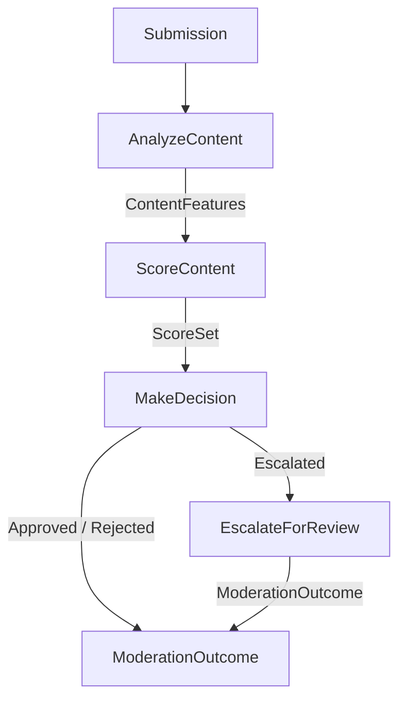

## ModerateContent

**Purpose:** Drives a submission through analysis, scoring, decision, and optional human review, returning a final moderation outcome.

### Inputs

| Name | Type | Description |
| --- | --- | --- |
| `submission` | [Submission](../../concepts/submission/concept.md#submission) | The content to moderate. |

### Outputs

| Name | Type | Description |
| --- | --- | --- |
| `outcome` | [ModerationOutcome](../../concepts/moderation/concept.md#moderationoutcome) | The final moderation decision and its provenance. |

### Invariants

- `outcome.submission_id` equals `submission.id`.
- `outcome.decision` is never `Escalated` — escalation is an internal routing step, not a terminal decision.

### Failure Modes

| Failure | Condition | Effect |
| --- | --- | --- |
| `AnalysisError` | The submission content cannot be analyzed. | Error propagated to caller. |
| `ScoringModelUnavailable` | The scoring model cannot be reached. | Error propagated to caller. |
| `InsufficientScores` | Scores contain no dimensions covered by configured policy. | Error propagated to caller. |
| `NoReviewerAvailable` | Escalation is required but no reviewer can accept the request. | Error propagated to caller. |

### Visualization

