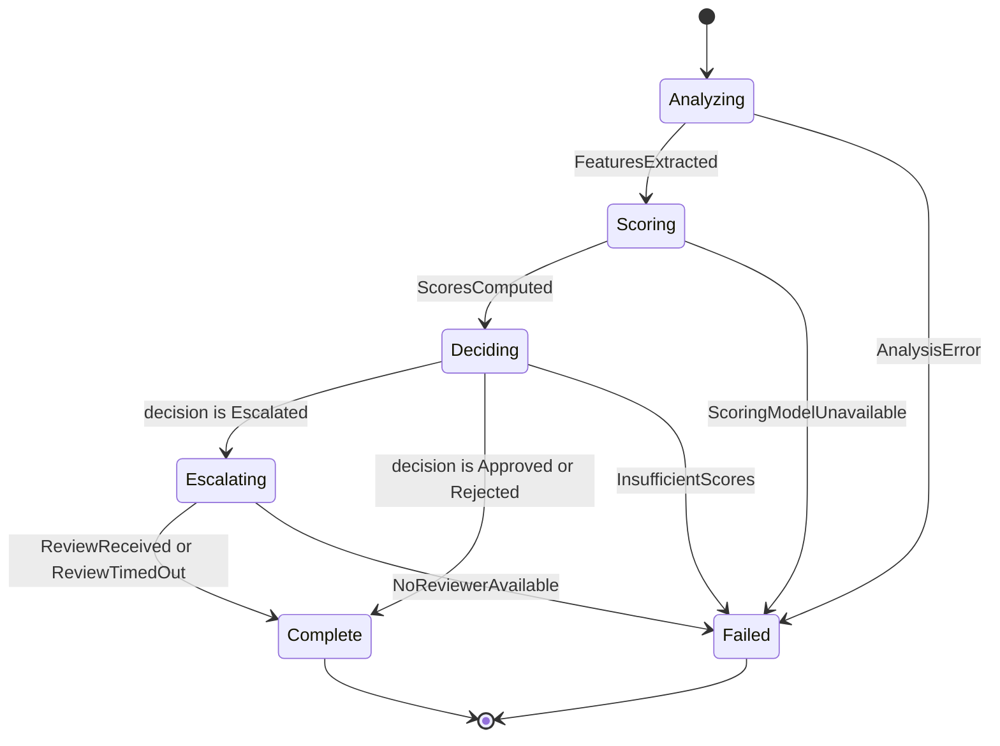

## State Machine

**Summary:** Coordinates the moderation lifecycle for a single submission, routing through analysis, scoring, and decision, with optional escalation to human review.

### Orchestrator

`ModerateContent` owns all transitions. It invokes each sub-ability in sequence, carries outputs forward to the next state's inputs, and evaluates transition conditions on each result.

#### Orchestrator-Managed State

| Name | Type | Description |
| --- | --- | --- |
| `submission` | [Submission](../../concepts/submission/concept.md#submission) | The submission being processed; passed to every sub-ability. |
| `features` | optional [ContentFeatures](../../concepts/submission/concept.md#contentfeatures) | Set when leaving `Analyzing`; passed to `ScoreContent`. |
| `scores` | optional [ScoreSet](../../concepts/moderation/concept.md#scoreset) | Set when leaving `Scoring`; passed to `MakeDecision` and `EscalateForReview`. |

### States

| State | Ability | Description |
| --- | --- | --- |
| `Analyzing` | `AnalyzeContent` | Extracts textual features from the submission. |
| `Scoring` | `ScoreContent` | Computes policy scores from the extracted features. |
| `Deciding` | `MakeDecision` | Applies policy rules to produce a decision. |
| `Escalating` | `EscalateForReview` | Requests human review and waits for a response. |
| `Complete` | — | Terminal state; outcome is available. |
| `Failed` | — | Terminal state; processing could not complete. |

### Transitions

| From | To | Trigger | Data Passed Forward |
| --- | --- | --- | --- |
| `Analyzing` | `Scoring` | `FeaturesExtracted` — `AnalyzeContent` returns `features` | `features` → `ScoreContent` |
| `Analyzing` | `Failed` | `AnalysisError` — `AnalyzeContent` fails | — |
| `Scoring` | `Deciding` | `ScoresComputed` — `ScoreContent` returns `scores` | `scores` → `MakeDecision` |
| `Scoring` | `Failed` | `ScoringModelUnavailable` — `ScoreContent` fails | — |
| `Deciding` | `Escalating` | `decision` is `Escalated` | `submission`, `scores` → `EscalateForReview` |
| `Deciding` | `Complete` | `decision` is `Approved` or `Rejected` | `decision` → `ModerationOutcome` |
| `Deciding` | `Failed` | `InsufficientScores` — `MakeDecision` fails | — |
| `Escalating` | `Complete` | `ReviewReceived` or `ReviewTimedOut` — `EscalateForReview` returns outcome | reviewer outcome → `ModerationOutcome` |
| `Escalating` | `Failed` | `NoReviewerAvailable` — `EscalateForReview` fails | — |

### Transition Rules

- `Deciding` evaluates `Escalated` before `Approved` and `Rejected`: if any score falls in the configured escalation band, the decision is `Escalated` regardless of other scores.

### Exceptional Flows

#### ReviewTimeout

If no human review is received within the review deadline, `EscalateForReview` returns a fallback `ModerationOutcome` with `decided_by` set to `"timeout-policy"`. The machine transitions to `Complete` via the `ReviewTimedOut` trigger.