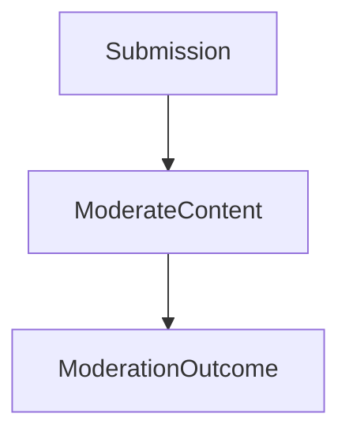

## Content Moderation

**Version:** v1.0.0
**Status:** Stable
**Summary:** Accepts a user-generated submission and produces a moderation outcome by analyzing content, scoring it across policy dimensions, and applying a decision — escalating to human review when scores fall in an ambiguous range.

### Invariants

- Every submission that enters the pipeline receives exactly one `ModerationOutcome`.
- A submission is never automatically approved or rejected while it is under human review.

### Visualization

