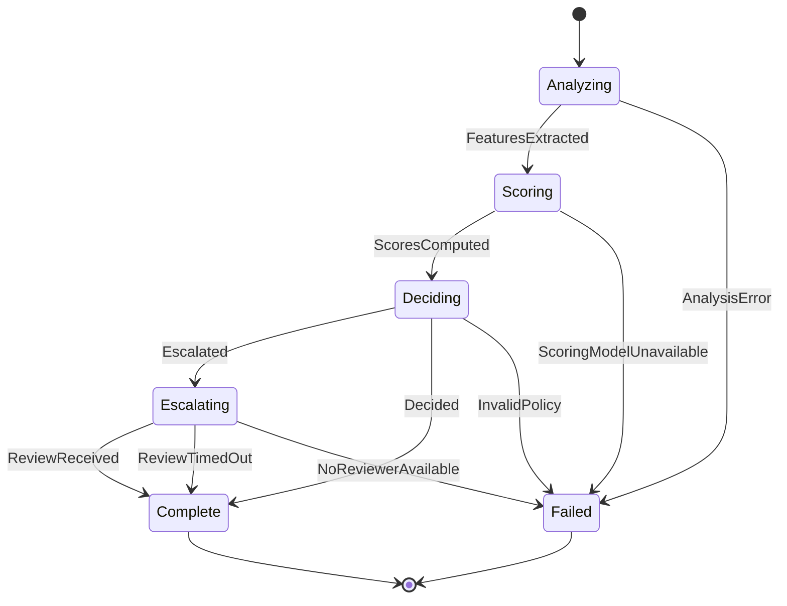

## State Machine

Coordinates the moderation lifecycle for a single submission, routing through analysis, scoring, and decision, with optional escalation to human review.

### Orchestrator

`ModerateContent` owns all transitions. It invokes each sub-ability in sequence, carries outputs forward to the next state's inputs, and evaluates transition conditions on each result.

#### Orchestrator-Managed State

| Name         | Type                                                                       | Description                                                                                |
| ------------ | -------------------------------------------------------------------------- | ------------------------------------------------------------------------------------------ |
| `submission` | [Submission](concepts/submission/concept.md#submission)                    | The submission being processed; passed to every sub-ability that needs it.                 |
| `policy`     | [ModerationPolicy](concepts/moderation/concept.md#moderationpolicy)        | The policy in force for this submission; passed to `MakeDecision` and `EscalateForReview`. |
| `features`   | optional [ContentFeatures](concepts/submission/concept.md#contentfeatures) | Set when leaving `Analyzing`; passed to `ScoreContent`.                                    |
| `scores`     | optional [ScoreSet](concepts/moderation/concept.md#scoreset)               | Set when leaving `Scoring`; passed to `MakeDecision` and `EscalateForReview`.              |

### States

| State        | Ability             | Description                                                    |
| ------------ | ------------------- | -------------------------------------------------------------- |
| `Analyzing`  | `AnalyzeContent`    | Extracts textual features from the submission.                 |
| `Scoring`    | `ScoreContent`      | Computes policy scores from the extracted features.            |
| `Deciding`   | `MakeDecision`      | Applies the policy to the scores to produce a decision.        |
| `Escalating` | `EscalateForReview` | Requests human review and waits for a verdict or the deadline. |
| `Complete`   | —                   | Terminal state; an outcome is available.                       |
| `Failed`     | —                   | Terminal state; processing could not complete.                 |

### Transitions

| From         | To           | Trigger                                                                                        | Data Passed Forward                                            |
| ------------ | ------------ | ---------------------------------------------------------------------------------------------- | -------------------------------------------------------------- |
| `Analyzing`  | `Scoring`    | `FeaturesExtracted` — `AnalyzeContent` returns `features`                                      | `features` → `ScoreContent`                                    |
| `Analyzing`  | `Failed`     | `AnalysisError` — `AnalyzeContent` fails                                                       | —                                                              |
| `Scoring`    | `Deciding`   | `ScoresComputed` — `ScoreContent` returns `scores`                                             | `scores` → `MakeDecision`                                      |
| `Scoring`    | `Failed`     | `ScoringModelUnavailable` — `ScoreContent` fails                                               | —                                                              |
| `Deciding`   | `Escalating` | `Escalated` — `MakeDecision` returns `Escalated`                                               | `submission`, `scores`, `policy` → `EscalateForReview`         |
| `Deciding`   | `Complete`   | `Decided` — `MakeDecision` returns `Approved` or `Rejected`                                    | `decision` → `ModerationOutcome` with `decided_by` of `Policy` |
| `Deciding`   | `Failed`     | `InvalidPolicy` — `MakeDecision` fails                                                         | —                                                              |
| `Escalating` | `Complete`   | `ReviewReceived` — `EscalateForReview` returns an outcome with `decided_by` of `Reviewer`      | reviewer outcome → `ModerationOutcome`                         |
| `Escalating` | `Complete`   | `ReviewTimedOut` — `EscalateForReview` returns an outcome with `decided_by` of `TimeoutPolicy` | timeout outcome → `ModerationOutcome`                          |
| `Escalating` | `Failed`     | `NoReviewerAvailable` — `EscalateForReview` fails                                              | —                                                              |

### Transition Rules

- Rejection takes precedence over escalation: a submission with any score at or above `policy.rejection_threshold` is `Rejected` even if another score falls in the escalation band.
- `Failed` is terminal and produces no outcome; the failure that caused the transition is propagated to the caller of `ModerateContent`.

### Exceptional Flows

#### ReviewTimeout

If no review is received within `policy.review_deadline`, `EscalateForReview` returns a fallback `ModerationOutcome` whose `verdict` is `policy.timeout_verdict` and whose `decided_by` is `TimeoutPolicy`. The machine transitions to `Complete` via the `ReviewTimedOut` trigger.
