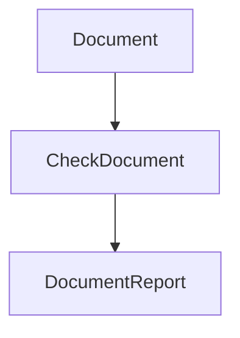

## Link Checker

**AASDD:** v1
**Version:** 1.0.0
**Summary:** Accepts a document and returns a report indicating which of its links are alive, dead, or unreachable.

### Invariants

- Every link extracted from the document appears in the report exactly once.
- The report's total count equals the number of unique links in the document.

### Visualization

